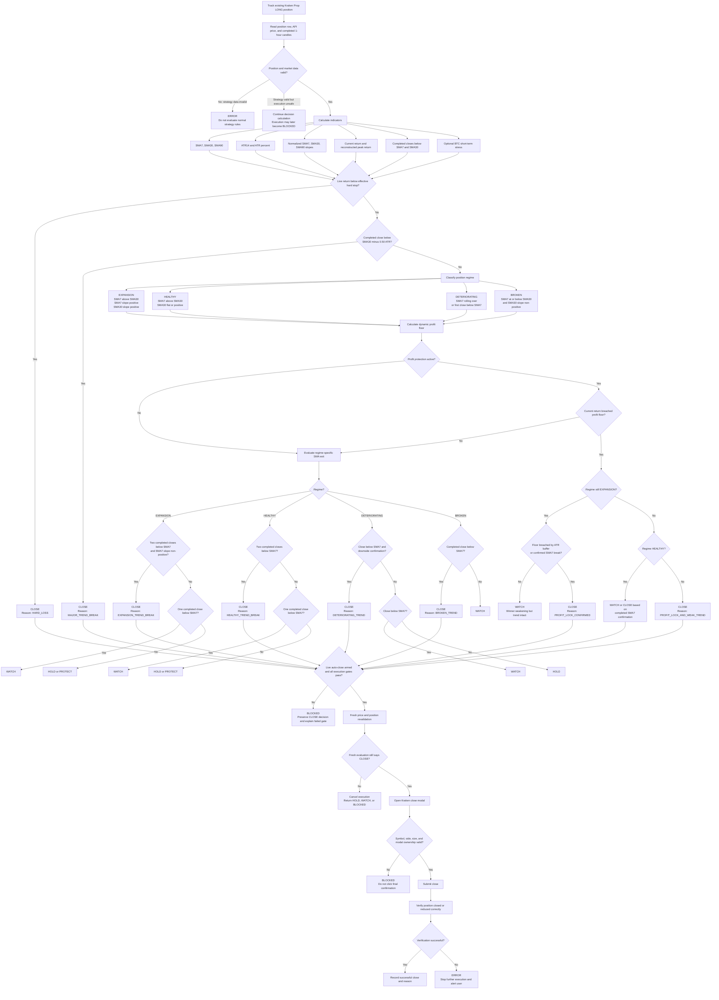

# Kraken Overnight Guard



A local, unpacked Chrome extension (Manifest V3) that monitors your existing
Kraken Prop LONG positions overnight and shows HOLD/WATCH/CLOSE/BLOCKED/
ERROR/CLOSED decisions on a dashboard. This build can close existing Kraken
Prop LONG positions only through the guarded manual-close flow or after
explicitly arming LIVE Auto-Close.

> **Warning:** This extension interacts with a live trading interface.
> Browser state, exchange UI changes, session expiry, network failures,
> delayed or mismatched price data, slippage, laptop sleep, and software
> defects can cause missed or unintended exits. The extension must never
> store exchange credentials or attempt to bypass exchange security
> controls. Confirm that automated browser interaction is permitted for the
> applicable Kraken Prop account before enabling final automatic execution.

The previous Python/Playwright approach for this project is archived,
unmodified, under [`python-legacy/`](python-legacy/) (its own README there
explains why).

## What this build does and does not do

Does:
- Detects open positions on the Kraken Prop Portfolio page (read-only DOM parsing).
- Fetches public Kraken market data and computes 1-hour SMA7/SMA30.
- Tracks current return, peak return, and a monotonically-rising profit floor.
- Evaluates hard-loss / profit-protection / SMA-trend-break exit rules every 5 minutes.
- Shows one card per position with a decision and a plain-English reason.
- Detects session/page-health problems (logged out, CAPTCHA, 2FA, device approval, session-expired modal) and stale market data.
- Writes a bounded, sanitized local audit log you can export.
- Can open and submit Kraken's existing LONG-position close dialog after
  manual confirmation, or after LIVE Auto-Close is explicitly armed and
  preflight/final revalidation checks pass.

Does not:
- Open, short, buy, add margin, increase size, or create new exposure.
- Partially close positions.
- Retry failed or uncertain close attempts automatically.
- Automate login, 2FA, passkeys, CAPTCHA, or device approval. It never
  reads or stores your username, password, 2FA code, cookies, or session
  tokens.

## Live-close safety model

- **Start Monitoring** is monitor-only.
- **Arm Auto-Close Dry Run** logs qualifying close intents but does not click
  Kraken's final confirmation.
- **Arm LIVE Auto-Close** requires a preflight pass, an explicit duration,
  and a browser acknowledgment. LIVE mode disarms on dangerous runtime
  conditions such as sleep gaps, logout, stale API data, parser degradation,
  ambiguous close controls, modal-validation failure, or uncertain close
  verification.
- Manual close remains admin-confirmed: open the Kraken close dialog, verify
  the side-panel summary, then click Confirm Close.

## Installing from a clean Mac

1. Install [Node.js](https://nodejs.org) 20+ (check with `node --version`).
2. From the repo root: `npm install`
3. Build the extension: `npm run build` — this produces `dist/`.
4. Open `chrome://extensions` in Google Chrome.
5. Enable **Developer mode** (top-right toggle).
6. Click **Load unpacked**.
7. Select this repo's `dist/` folder.
8. Pin the extension (puzzle-piece icon in the toolbar → pin "Kraken Overnight Guard").

Re-run `npm run build` (or `npm run watch` during development) and click the reload icon on `chrome://extensions` after any code change.

## Using it

9. Open `https://pro.kraken.com/prop/...` and go to the Portfolio page.
10. Log into Kraken **manually** — including any 2FA/passkey step. The extension never touches this.
11. Click the extension's toolbar icon to open the **side panel** (it opens automatically on click; no separate menu needed).
12. Click **Start Monitoring**. This only works if a Kraken Prop tab is already open.
13. Read the position cards: entry/current/API price, value, P&L, current and peak return, SMA7/SMA30, trend, decision, and a plain-English reason.
14. Click **Test Notification** to confirm Chrome notifications work.
15. Click **Export Logs** to download the sanitized audit log as JSON.

## Old laptop reliability

For unattended overnight use, the dedicated laptop must:
- stay plugged into power (check System Settings → Battery → prevent sleep on power adapter — do this yourself; the extension does not change OS settings),
- stay awake (no lid-closed sleep),
- have stable Wi-Fi,
- keep Chrome running with the Kraken Prop tab open,
- stay manually logged into Kraken.

The side panel's Status section shows: monitoring status, last position scan, last price update, next scheduled update, and a warning banner if scheduled checks were missed (a likely sleep/wake gap — the extension re-validates everything from scratch rather than act on data from before the gap).

## Recovering from common problems

- **Logged out / CAPTCHA / 2FA / device approval:** every position card shows `ERROR` with a "Login required" reason, and a Chrome notification fires. Log in manually, then use Refresh Positions (Start/Stop again if needed) — there is no "acknowledge" step because nothing was ever armed to disarm in this build.
- **Kraken tab closed:** a notification fires; monitoring state is retained. Reopen the Portfolio page.
- **Unsupported symbol:** shows `ERROR`; extend `src/api/symbols.ts`'s `SYMBOL_MAP` with the new UI-symbol → Kraken-pair mapping and rebuild.
- **Laptop slept:** the Status panel shows a missed-checks warning; all market data and page state are re-fetched and re-validated before any decision is trusted.
- **Updating the extension:** rebuild (`npm run build`) and click the reload icon for this extension on `chrome://extensions`.

## Configuration

Defaults (`src/shared/constants.ts`, editable from the side panel Settings screen):

```
pollMinutes: 5
candleIntervalMinutes: 60
fastSma: 7
slowSma: 30
longSma: 90
atrPeriod: 14
slope7LookbackHours: 3
slope30LookbackHours: 6
slope90LookbackHours: 12
hardLossFallbackPct: -3
hardLossMinDistancePct: -1.75
hardLossMaxDistancePct: -3
hardLossAtrMultiple: 2
hardLossConfirmationSeconds: 20
hardLossRequiredObservations: 2
profitActivationPct: 3
profitActivationAtrMultiple: 1.75
majorTrendBreakAtrBuffer: 0.5
expansionFloorAtrBuffer: 0.35
deteriorationAtrBreakBuffer: 0.35
expansionFastBreakAtrBuffer: 0.5
slope7StrongPositive: 0.15
slope7Positive: 0.03
slope7Negative: -0.03
slope30StrongPositive: 0.06
slope30FlatLowerBound: -0.04
btcStressEnabled: false
apiUiPriceTolerancePercent: 1
strongTrendConfirmationCloses: 2
weakTrendConfirmationCloses: 1
autoCloseDurationHours: 8
maxLiveClosesPerHour: 2
maxLiveClosesPerArmedSession: 5
autoCloseSignalExpiryMinutes: 5
closeVerificationTimeoutSeconds: 10
sleepGapWarningMinutes: 10
requireRearmAfterGapMinutes: 30
executionMode: MONITOR_ONLY
alarmSoundEnabled: true
```

SMA7/SMA30 here mean **7 and 30 completed 1-hour closes** (35 and 30 hours of history respectively is wrong — it's literally the last 7 and last 30 hourly candles, i.e. roughly the last ~7 and ~30 hours). The currently-forming hour is always excluded.

## Volatility-adjusted strategy

Purpose: manage existing Kraken Prop LONG positions only. The strategy never opens, adds, reverses, shorts, buys, or reenters. `PROTECT` is display-only and behaves operationally like `HOLD`; only `CLOSE` can reach the live close pipeline.

Inputs:
- parsed Kraken Prop LONG row: symbol, side, entry, current UI price, value, P&L, leverage;
- Kraken public ticker price for live return and hard-loss validation;
- completed Kraken public 1-hour OHLC candles only;
- persisted per-lot peak/floor/debounce state keyed by fingerprint;
- execution safety gates from the service worker and content script.

Indicators:
- `SMA7`, `SMA30`, `SMA90`: simple moving averages of completed hourly closes.
- `ATR14`: average true range over 14 completed hourly candles using `max(high-low, abs(high-previousClose), abs(low-previousClose))`.
- `atrPct = ATR14 / latestCompletedClose`.
- `slope7 = (SMA7 now - SMA7 3 completed hours ago) / ATR14`.
- `slope30 = (SMA30 now - SMA30 6 completed hours ago) / ATR14`.
- `slope90 = (SMA90 now - SMA90 12 completed hours ago) / ATR14`.

Regimes:
- `EXPANSION`: SMA7 > SMA30, SMA7 slope positive, SMA30 slope positive, latest completed close >= SMA7.
- `HEALTHY`: SMA7 > SMA30 and SMA30 is flat/positive, but not EXPANSION.
- `DETERIORATING`: SMA7 rolling over, first close below SMA7, or SMA30 weakening.
- `BROKEN`: SMA7 <= SMA30 and SMA30 slope is non-positive.
- Tie-break order is BROKEN, EXPANSION, DETERIORATING, HEALTHY.

Rule priority:
1. Strategy data validity. If SMA90/ATR/slope history is insufficient, return `ERROR` and block live execution.
2. Hybrid hard-loss protection.
3. Major SMA30 trend break.
4. Regime classification.
5. Dynamic profit protection.
6. Regime-specific SMA7 exits.
7. Otherwise `HOLD` or display-only `PROTECT`.
8. Execution safety gating converts unsafe `CLOSE` to `BLOCKED`.
9. Fresh pre-close revalidation must still produce `CLOSE`.

Hard loss:
- `atrStopPct = -(hardLossAtrMultiple * ATR14 / entryPrice * 100)`.
- `effectiveHardLossPct = clamp(atrStopPct, -3.0%, -1.75%)` by default.
- ATR stop `-1.2%` becomes `-1.75%`; `-2.4%` remains `-2.4%`; `-4.5%` becomes `-3.0%`.
- If ATR is unavailable but hard-loss inputs are otherwise reliable, fallback is `-3.0%`.
- Live hard-loss close requires validated API price, at least 2 observations, and the debounce duration. One malformed tick cannot close a position.

Profit protection:
- Activates when peak return is at least `+3%` or the peak move is at least `1.75 ATR`.
- Floors ratchet upward and never loosen:
  - peak `+3%` to below `+7%`: max `+0.5%`, `35%` of peak;
  - peak `+7%` to below `+15%`: max `+3%`, `50%` of peak;
  - peak `+15%` to below `+30%`: max `+7%`, `60%` of peak;
  - peak `+30%+`: max `+15%`, `70%` of peak.
- In EXPANSION, a floor touch returns `WATCH` unless breached by the ATR buffer or confirmed by SMA7 weakness.
- In DETERIORATING/BROKEN, a floor breach returns `CLOSE`.

SMA7 exits:
- EXPANSION: `CLOSE` on two completed closes below SMA7 with non-positive SMA7 slope, or fast ATR-buffer breakdown; one close below SMA7 is `WATCH`.
- HEALTHY: first completed close below SMA7 is `WATCH`; second is `CLOSE`.
- DETERIORATING: close below SMA7 plus prior-low break, second close below SMA7, or ATR-buffer break is `CLOSE`; otherwise `WATCH`.
- BROKEN: completed close below SMA7 is `CLOSE`; otherwise `WATCH`.

SMA90 and BTC:
- SMA90 is context and diagnostics. The strategy does not close a strong short-term trend solely because price is below SMA90.
- BTC stress is feature-flagged off by default. Without reliable BTC stress data, core strategy continues without it.

Outputs:
- `HOLD`: no exit rule active.
- `PROTECT`: profitable position with protection active and trend intact; operationally HOLD.
- `WATCH`: weakness observed but confirmation is pending.
- `CLOSE`: strategy wants to close the existing LONG.
- `BLOCKED`: strategy may be CLOSE, but execution safety failed.
- `ERROR`: strategy data invalid or market data unavailable.

Execution safety gates:
- unresolved public market mapping;
- API/UI price mismatch;
- stale or invalid market data;
- unhealthy parser or logged-out/unknown session;
- changed position fingerprint or unsupported structure;
- ambiguous close-control ownership;
- inactive keep-awake or detected sleep gap;
- failed final modal validation;
- inability to verify the close result.

Worked examples:
1. A small loser has ATR14 = `1.2` on a `100` entry. The effective stop is `-2.4%`; after debounce confirmation at `97.60`, decision is `CLOSE`.
2. A strong `+10%` winner in EXPANSION closes once below SMA7. Decision is `WATCH`.
3. The same winner recovers above SMA7 with positive slopes. Decision returns to `PROTECT`.
4. A winner breaches its profit floor while regime is BROKEN. Decision is `CLOSE` with `PROFIT_LOCK_AND_WEAK_TREND`.
5. Latest completed close is `0.5 ATR` below SMA30. Decision is immediately `CLOSE` with `MAJOR_TREND_BREAK`.
6. Strategy says `CLOSE`, but API/UI price mismatch is `1.4%`. Final output is `BLOCKED`.
7. Only 80 completed candles exist. SMA90/slope history is insufficient, so output is `ERROR` and execution is blocked.
8. BTC is below a long moving average but BTC stress is disabled or short-term stress is absent, so the altcoin remains governed by its own regime.
9. A new lot in the same symbol receives a new fingerprint and starts with its own peak/floor state.

Limitations:
- The current Kraken parser does not expose a reliable entry timestamp, so historical peak reconstruction does not use pre-existing candle highs. Peak uses the persisted tracked peak plus validated live API prices until entry time is available.
- No partial-close support.
- No automatic login, retries, reentry, or buy-side transactions.

## Market Data table

Below the Status section, a read-only table shows **one row per unique
symbol** (not per lot): API market, current API price, last completed
1-hour close, SMA7/SMA30, trend, price-vs-SMA percentages, latest candle
time, candles loaded, and API status. It updates whenever a scan
completes — during Monitor Only polling or after **Refresh Positions** —
and needs no API key (Kraken's public `OHLC`/`Ticker` endpoints only).

If zero positions are currently detected, a small developer watchlist
(`XPL`, `JTO` — see `DEV_WATCHLIST_SYMBOLS` in `src/shared/constants.ts`)
still populates the table so it can be exercised independently of row
discovery. Watchlist rows are labeled **WATCHLIST**; a symbol backing a
real detected position is labeled **DETECTED**. The watchlist has no
effect on execution or the strategy engine — it only triggers a market
data fetch for display.

## Testing

```bash
npm run typecheck
npm run lint
npm test
npm run build
```

## DOM Diagnostics (read-only)

`src/content/position-parser.ts`, `kraken-dom.ts`, and `page-health.ts` were
written without access to Kraken Prop's actual DOM — there was no fixture
to inspect. They use semantic, layered heuristics (accessible roles,
`aria-label`, `data-testid` keyword matching, then a label:value text
fallback) and **default to skipping a row rather than guessing a wrong
value**, but they have not been run against your logged-in session yet.

To validate this safely, the side panel has a **Run DOM Diagnostics**
button. It never clicks or hovers anything — it only reads the page and
reports what it finds:

- Page health: current page / Kraken domain / Prop URL / Portfolio page
  detected, logged-in state (YES/NO/UNKNOWN), positions section detected,
  candidate row count vs. resolved position count.
- Per candidate row: sanitized raw visible text, every parsed field
  (symbol/side/value/opening price/current price/UP&L/Net P&L/leverage) or
  `UNKNOWN` if a field couldn't be read, whether a Close control was found
  and what's known about its accessible name (aria-label/title/data-testid/
  visible text — **never by hovering**; if none of those exist, it says so
  explicitly rather than guessing), and the full list of interactive
  controls in that row.
- Position-group evidence: how a summary row and its actionable child
  row(s) were linked (DOM containment, `aria-controls`, a shared `data-*`
  attribute, or weak adjacency/document-order proximity + symbol match —
  labeled as such), or an explicit `AMBIGUOUS` flag when structural evidence
  can't tell two rows apart. **A market can have more than one open lot**
  (e.g. two XPL LONG rows at different opening prices) — multiple
  actionable children under one summary is normal, not ambiguous, as long
  as they're distinguishable (opening price first, value second).
- A structural census of the Open positions section when row discovery
  finds nothing useful: div/role counts, which keywords ("Long", "Short",
  "XPL", "JTO", "USD", "Add") appear and how often, distinct `data-*`/
  `aria-label`/`title` attribute names seen anywhere, and — for a few
  sample "Long"/"Short" and symbol text anchors — their full ancestor
  chain (tag, role, direct child count, button count) so the smallest
  matching row container can be identified by hand.

Row discovery itself tries semantic markup first (`role="row"`, `<tr>`,
`data-testid*="position-row"`) and only falls back to a conservative
text-anchor algorithm (walk up from an exact "Long"/"Short" or symbol text
node to the smallest ancestor that also has the other required fields)
when semantics find nothing — which is what Kraken's real, plain-div
Positions markup requires. The report says which one actually ran
(`rowDiscoveryMethod`).

Account IDs are redacted from the URL and from any "account ...id..." text
pattern, along with UUID-looking identifiers and email addresses. Nothing
reads cookies, localStorage, sessionStorage, or request headers — the report
shape itself has no field for any of them.

**Next step — run this against your real page:**
1. Load the unpacked extension and open the Kraken Prop Portfolio page.
2. Open the side panel and click **Run DOM Diagnostics**.
3. Compare the report's parsed fields against what Kraken actually shows.
4. Click **Copy Sanitized Diagnostics** and share that JSON back so
   `position-parser.ts`/`page-health.ts`/`position-grouping.ts`'s keyword
   lists and evidence signals can be tuned to what Kraken's real DOM
   actually exposes — most likely a targeted adjustment, not a rewrite.

The report is also printed to two consoles for convenience: the Kraken
tab's own DevTools console (content script) and the extension's service
worker console (`chrome://extensions` → "Inspect views: service worker").
